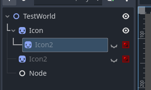
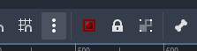
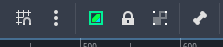
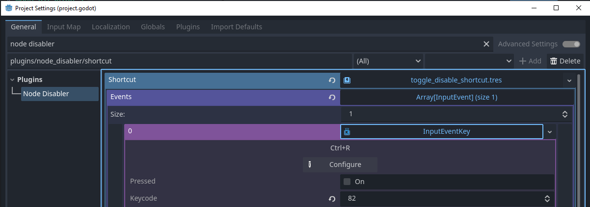

# Node disabler addon

Easily disable or enable nodes with a button or a shortcut.
There will also be an icon on them to display their status.

Shortcuts:
- Ctrl + R : Toggle selected nodes disable/enable

A node is considered disabled when their _proccess_mode_ is DISABLED and they are invisible.

https://github.com/user-attachments/assets/9e92f2eb-6e57-4ed8-adeb-2abc47d080b4

### **Shows icons for disabled nodes**

|

You can use the button on the top bar, or the hotkey to toggle selected nodes.

Click on the red icon to remove it, and re-enable the node.

# Configuration

You can change the shortcut on the Project Settings under `plugins/node_disabler`

# TODO

- Change behavior of multi-select to only toggle parents. Right now it toggles all selected nodes.
- Use a proper icon for the disabled nodes. Right now it is just the ColorRect icon with a tint.
